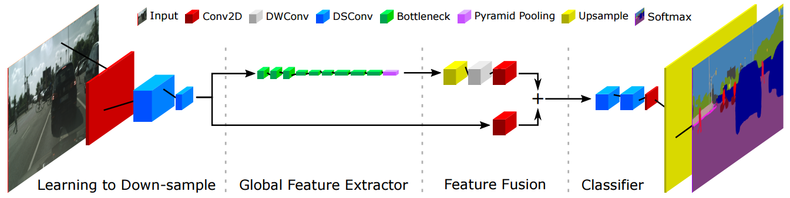
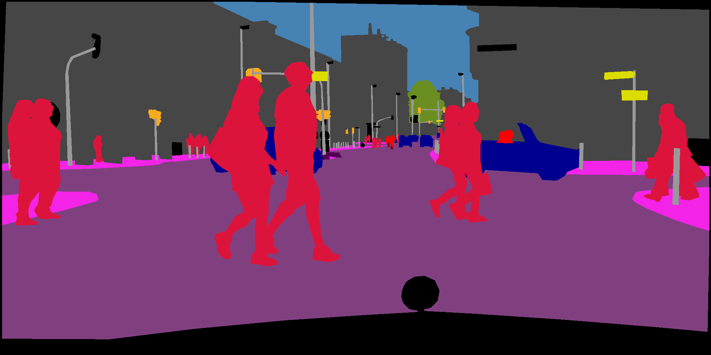

# Fast-SCNN: Fast Semantic Segmentation Network
A PyTorch implementation of [Fast-SCNN: Fast Semantic Segmentation Network](https://arxiv.org/pdf/1902.04502) from the paper by Rudra PK Poudel, Stephan Liwicki.

<p align="center"></p>

## Table of Contents
- <a href='#installation'>Installation</a>
- <a href='#datasets'>Datasets</a>
- <a href='#training-fast-scnn'>Train</a>
- <a href='#evaluation'>Evaluate</a>
- <a href='#demo'>Demo</a>
- <a href='#results'>Results</a>
- <a href='#todo'>TO DO</a>
- <a href='#references'>Reference</a>

## Installation
- Python 3.x. Recommended using [Anaconda3](https://www.anaconda.com/distribution/)
- [PyTorch 1.0](https://pytorch.org/get-started/locally/). Install PyTorch by selecting your environment on the website and running the appropriate command. Such as:
  ```
  conda install pytorch torchvision cudatoolkit=9.0 -c pytorch
  ```
- Clone this repository.
- Download the dataset by following the [instructions](#datasets) below.
- Note: For training, we currently support [cityscapes](https://www.cityscapes-dataset.com/), and aim to add [VOC](http://host.robots.ox.ac.uk/pascal/VOC/) and [ADE20K](http://groups.csail.mit.edu/vision/datasets/ADE20K/).

## Datasets
- You can download [cityscapes](https://www.cityscapes-dataset.com/) from [here](https://www.cityscapes-dataset.com/downloads/). Note: please download [leftImg8bit_trainvaltest.zip(11GB)](https://www.cityscapes-dataset.com/file-handling/?packageID=4) and [gtFine_trainvaltest(241MB)](https://www.cityscapes-dataset.com/file-handling/?packageID=1).

## Training-Fast-SCNN
- By default, we assume you have downloaded the cityscapes dataset in the `./datasets/citys` dir.
- To train Fast-SCNN using the train script the parameters listed in `train.py` as a flag or manually change them.
```Shell
python train.py --model fast_scnn --dataset citys
```

## Evaluation
To evaluate a trained network:
```Shell
python eval.py
```

## Demo
Running a demo:
```Shell
python demo.py --model fast_scnn --input-pic './png/berlin_000000_000019_leftImg8bit.png'
```

## Results
|Method|Dataset|crop_size|mIoU|pixAcc|
|:-:|:-:|:-:|:-:|:-:|
|Fast-SCNN(paper)|cityscapes||||
|Fast-SCNN(ours)|cityscapes|768|54.84%|92.37%|

Note: The result based on crop_size=768, which is different with paper.


&emsp;&emsp;&emsp;&emsp;&emsp;&emsp;(a) test image &emsp;&emsp;&emsp;&emsp;&emsp;&emsp;&emsp;&emsp;&emsp;&emsp;&emsp;(b) ground truth &emsp;&emsp;&emsp;&emsp;&emsp;&emsp;&emsp;&emsp;&emsp;&emsp;(c) predicted result

## TODO
- [ ] add distributed training
- [ ] Support for the VOC, ADE20K dataset
- [ ] Support TensorBoard
- [x] save the best model
- [x] add Ohem Loss
 
## Authors
* [**Tramac**](https://github.com/Tramac)

## References
- Rudra PK Poudel. et al. "Fast-SCNN: Fast Semantic Segmentation Network".
